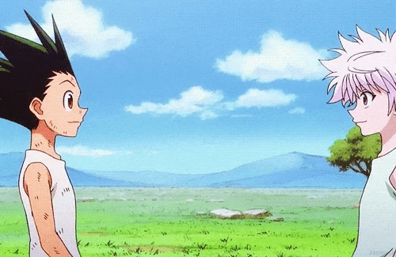

# Hi there

- 🚚 Today I work with Logistic: Assistent of risk
- 🐍 I'm studing python
- 👨‍🎓 I'm in University (Universidade da cidade de São Paulo)

  <a href="https://github.com/GustavoVaradi">
  
  

 
  
  
  

##

  
  
  
   

